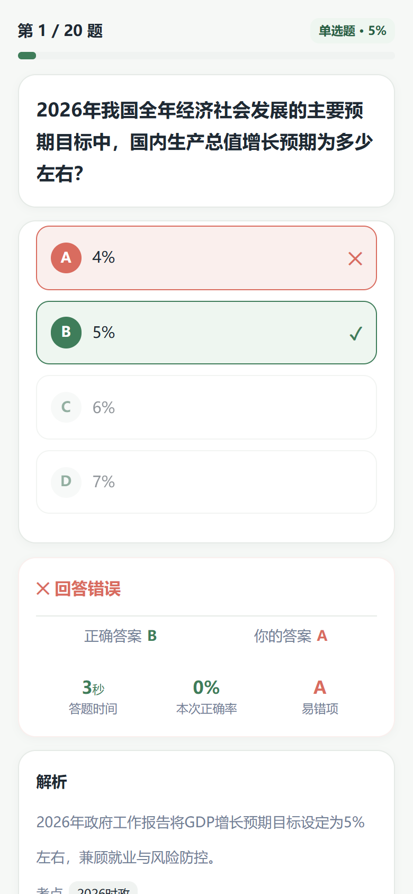
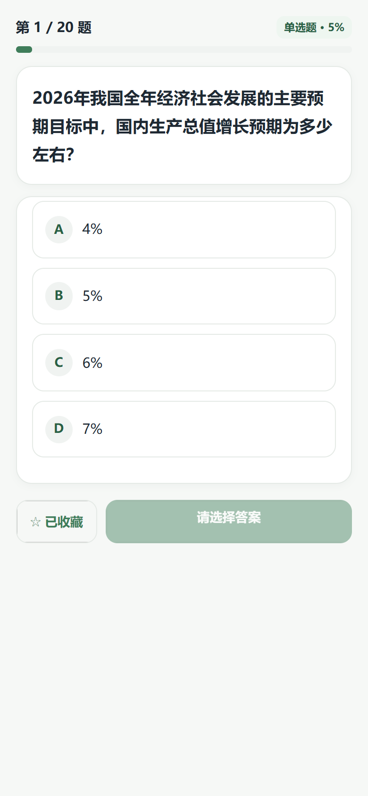

# CivicQuiz 刷题备考平台

一站式刷题备考平台，包含 **用户端小程序（H5 + 微信小程序）** 与 **管理端后台**。产品闭环：

> **学习目标 → 刷题 → 即时反馈 → 错题复习 → 模拟考试 → 学习数据**

<p align="center">
  <a href="docs/screenshots/home-green.png"></a>
  <a href="docs/screenshots/exams-green.png"></a>
  <a href="docs/screenshots/mine-green.png"></a>
</p>

## 产品定位

**「绿色 Civic + 轻量卡片 + 高留白 + 清晰数据 + 低刺激反馈」**

视觉关键词：清晰 / 安静 / 可信 / 高效 / 不焦虑。主色 `#3F7D5A`，错误 `#D96C5F`，收藏 `#D99A45`；去嵌套卡、去 emoji 装饰、轻边框优于重阴影。

## 功能特性

### 用户端（小程序）

- **学习驾驶舱（首页）**：今日任务进度、继续学习、今日建议（错题复习 / 收藏练习 / 继续刷题）、学习数据摘要、题库快捷入口
- **多模式刷题**：顺序 / 随机 / 错题重练 / 收藏练习，题量 10 / 20 / 50
- **即时判分与反馈**：单选 / 多选 / 判断均可作答；练习模式答完即判，展示对错、正确答案、解析、考点
- **答题体验**：进度条与百分比、选项四态（默认 / 已选 / 答对 / 答错）、未作答不能进入下一题；考试模式不提前显答案
- **模拟考试**：固定 / 随机组卷，倒计时（<5 分钟警示、到时自动交卷）、答题卡、上一题/下一题、续考恢复作答
- **考试闭环**：结果页 → 查看错题 / 再做一次 / 返回首页；答卷回顾逐题对错与解析
- **备考驾驶舱（我的）**：今日进度、学习数据网格（答题数 / 正确率 / 错题 / 收藏）、错题行动入口、最近考试（分数、正确率、题数、用时）
- **错题本 / 收藏夹**：掌握标记、移除、一键重练
- **设置**：外观主题（舒缓绿默认 / 暖棕）持久化切换

### 管理端（Admin）

- 题库 / 分类 / 题目全生命周期管理，**Excel / CSV 批量导入**（模板下载、失败行明细）
- 题目录入支持单选 / 多选 / 判断（选项 A–F、判断题 TRUE/FALSE）
- 考试管理：固定勾选组卷 / 按题型随机抽题（保存时固化试卷快照），发布 / 草稿 / 下架
- 考试记录、用户管理、工作台统计与错题率 Top10

<p align="center">
  <a href="docs/screenshots/admin-dashboard.png"></a>
</p>

## 页面预览

| 首页（舒缓绿） | 首页（暖棕主题） |
| --- | --- |
| [](docs/screenshots/home-green.png) | [](docs/screenshots/home-brown.png) |

| 题库刷题 | 模拟考试 |
| --- | --- |
| [](docs/screenshots/banks-green.png) | [](docs/screenshots/exams-green.png) |

| 答题反馈 | 我的 |
| --- | --- |
| [](docs/screenshots/result-green.png) | [](docs/screenshots/mine-green.png) |

| 答题进行中 | 管理后台 |
| --- | --- |
| [](docs/screenshots/quiz-green.png) | [](docs/screenshots/admin-dashboard.png) |

## 技术栈

| 端 | 技术 |
| --- | --- |
| Server | Nitro v3（Node）+ 嵌入式 PostgreSQL 18 + 参数化 SQL |
| Admin | Vite + React 19 + Ant Design 6 + TanStack Query + React Router 7 |
| Miniapp | Taro 4 + React，一套代码同时输出 H5 与微信小程序 |
| Shared | pnpm workspace monorepo，Zod schema 共享类型 |

## 快速开始

```bash
# 1. 安装依赖
pnpm install

# 2. 启动嵌入式 PostgreSQL（端口 55432，数据目录 .pgdata/）
node scripts/dev-db.cjs start

# 3. 建表 + 灌演示数据（幂等）
node scripts/migrate.cjs
node scripts/seed.cjs

# 4. 启动 API（端口 3000）
pnpm --filter @civicquiz/server dev

# 5. 启动管理后台（端口 5173，演示账号 admin / admin123）
pnpm --filter @civicquiz/admin dev

# 6. 启动小程序 H5（端口 10086）
pnpm --filter @civicquiz/miniapp dev:h5

# 微信小程序产物（微信开发者工具导入 apps/miniapp/dist）
pnpm --filter @civicquiz/miniapp build:weapp
```

根目录另有 **学习闭环可交互原型**（`index.html` + `styles.css` + `app.js`），浏览器直接打开即可预览信息架构，无需起服务。

## 目录结构

```
apps/
  server/        # Nitro API（40+ 接口，/api/admin/* 管理端，/api/* 用户端）
  admin/         # 管理后台 SPA
  miniapp/       # Taro 小程序（14 页：首页/刷题/考试/我的/设置/错题/收藏…）
packages/
  shared/        # zod schema 与共享类型
cloudbase/
  migrations/    # 数据库迁移 SQL（版本管理）
scripts/         # dev-db / migrate / seed / smoke-api
docs/
  PRD.md         # 产品需求文档
  compose/spec/  # compose-next 特性设计文档
  screenshots/
index.html       # 学习闭环信息架构可交互原型
```

## 设计体系（轻量专业备考）

| Token | 值 | 用途 |
| --- | --- | --- |
| Primary | `#3F7D5A` | 主操作 / 正确 / 当前状态 |
| Primary Dark | `#286044` | 主色文字强调 |
| Primary Light | `#EEF6F0` | 选中 / 主色浅底 |
| Background | `#F6F8F6` | 页面背景 |
| Surface | `#FFFFFF` | 主内容卡 |
| Text Primary | `#1F2933` | 主文字 |
| Text Secondary | `#718096` | 次文字 |
| Border | `#E5EAE6` | 边框 |
| Error | `#D96C5F` | 错误（柔和） |
| Warning | `#D99A45` | 收藏 / 提醒 |

- **层级**：页面背景 → 主内容卡（radius 16pt）→ 数据网格（非嵌套卡）
- **圆角**：按钮/选项 12pt · 卡片 16pt
- **阴影**：优先边框；阴影仅 `0 2px 8px rgba(31,41,51,0.04)` 级
- **双主题**：舒缓绿（默认）/ 暖棕，设置页切换

## 数据模型

15 张核心表：`sys_admin`、`sys_user`、`question_bank`、`question_category`、`question`、`question_option`、`question_answer`、`practice`、`user_question_record`、`user_wrong_question`、`user_favorite_question`、`exam`、`exam_question`（组卷快照）、`user_exam`、`user_exam_answer`（答案 JSONB，答题记录只追加不覆盖）。

## 性能设计

### 数据库
- 高频过滤/排序列建组合索引；清理冗余索引，降低答题写入维护开销
- 学情统计单条 CTE 聚合，1 次往返；管理端 COUNT 与数据并行查询
- 连接池 `max=20`（`PG_POOL_MAX` 可调），连接超时 5s、查询超时 10s

### 前端
- **H5 分包**：第三方依赖独立 `vendors` chunk；业务 `app.js` 约 33KB，页面按需加载
- **小程序**：主包约 500KB，远低于 2MB 限制
- **请求去重**：`useDidShow` 统一触发加载；冷启动等待静默登录，避免首屏 401
- **管理端**：React Query `staleTime=30s`，写操作后精确失效

### 构建
- Taro webpack 持久化缓存，二次构建只重编译改动模块

### 健壮性与安全
- 核心入参 Zod 校验（登录 / 开始练习 / 提交答案 / 交卷 / 导入）
- 统一错误 `{ error: true, message }`；生产隐藏 5xx 堆栈
- 生产缺 `JWT_SECRET` / `DATABASE_URL` 拒绝启动
- ID 类型统一 number；SQL 全部参数化

### 部署建议
- 静态资源与 API 启用 gzip / brotli + 长缓存 + 文件名 hash
- 生产必配：`JWT_SECRET`、`DATABASE_URL`、`WX_APPID`、`WX_APP_SECRET`；收紧 CORS

## 文档

| 文档 | 说明 |
| --- | --- |
| [docs/PRD.md](docs/PRD.md) | 产品需求（功能 / 业务规则 / 非功能 / 验收） |
| [docs/compose/spec/learning-cockpit-taro.md](docs/compose/spec/learning-cockpit-taro.md) | 学习闭环信息架构落地 |
| [docs/compose/spec/ui-light-pro.md](docs/compose/spec/ui-light-pro.md) | 轻量专业视觉体系 |
| [docs/compose/spec/learning-cockpit-mvp.md](docs/compose/spec/learning-cockpit-mvp.md) | HTML 原型设计 |

## 验收

```bash
# API 全链路冒烟
python scripts/smoke-api.py

# 小程序类型检查与 H5 构建
pnpm --filter @civicquiz/miniapp typecheck
pnpm --filter @civicquiz/miniapp build:h5
```
