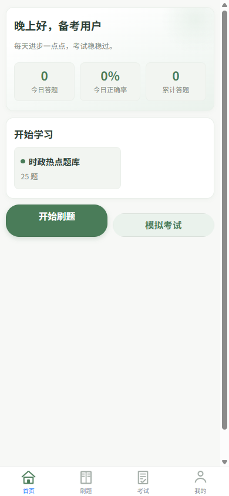
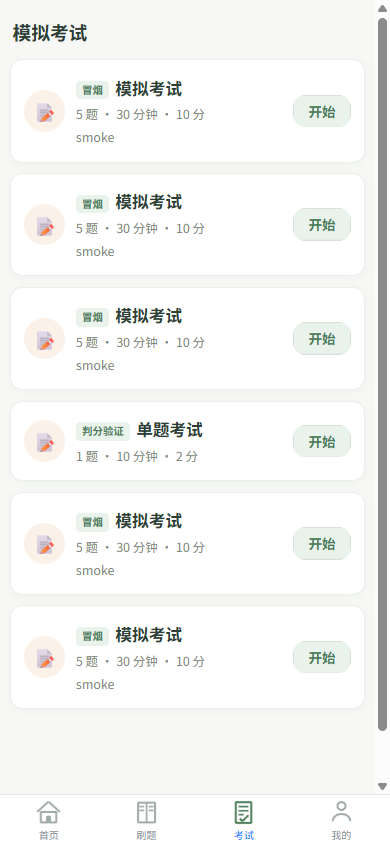
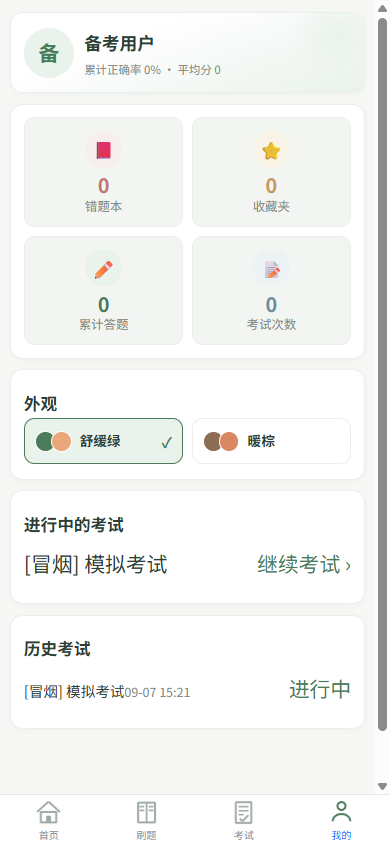
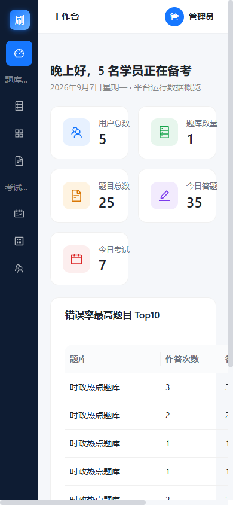
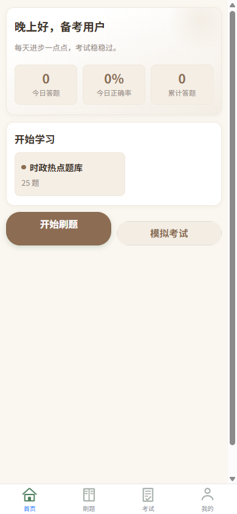
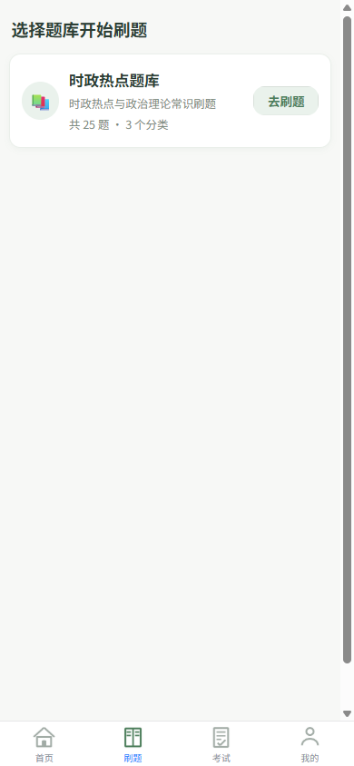

# CivicQuiz 刷题备考平台

一站式刷题备考平台，包含 **用户端小程序（H5 + 微信小程序）** 与 **管理端后台**，支持题库管理、顺序/随机/错题/收藏练习、模拟考试与成绩复盘。

<p align="center">
  
  
  
</p>

## 功能特性

### 用户端（小程序）
- 🗂️ **题库浏览**：题库列表 + 分类树，题目数量一目了然
- ✍️ **多模式刷题**：顺序练习 / 随机练习 / 错题重练 / 收藏练习，支持 10/20/50 题组卷
- ✅ **即时判分**：单选 / 多选 / 判断三种题型，答题即判、答案解析即时反馈
- 📝 **模拟考试**：固定 / 随机两种组卷规则，倒计时计时、自动判分、交卷复盘逐题回顾
- 📊 **学情统计**：今日答题、正确率、累计答题、错题本、收藏夹、考试历史
- 🎨 **双主题**：舒缓苔绿（默认）/ 燕麦暖棕，一键切换、持久保存，低饱和护眼配色

### 管理端（Admin）
- 题库 / 分类 / 题目全生命周期管理，支持 **Excel 批量导入**（含模板下载、失败明细）
- 考试管理：固定题目组卷 / 按规则随机抽题，发布 / 草稿 / 下架状态流转
- 考试记录、用户管理、平台运营统计看板

<p align="center">
  
</p>

## 页面预览

| 首页（舒缓绿） | 首页（暖棕主题） |
| --- | --- |
|  |  |

| 题库刷题 | 模拟考试 |
| --- | --- |
|  |  |

| 我的（金刚区 + 主题切换） | 管理后台 |
| --- | --- |
|  |  |

## 技术栈

| 端 | 技术 |
| --- | --- |
| Server | Nitro v3（Node）+ 嵌入式 PostgreSQL 18 + 参数化 SQL |
| Admin | Vite + React 19 + Ant Design 6 + TanStack Query + React Router 7 |
| Miniapp | Taro 4 + React，一套代码同时输出 H5 与微信小程序 |
| Shared | pnpm workspace monorepo，Zod schema 共享类型 |

## 快速开始

```bash
# 1. 安装依赖
pnpm install

# 2. 启动嵌入式 PostgreSQL（端口 55432，数据目录 .pgdata/）
node scripts/dev-db.cjs start

# 3. 建表 + 灌演示数据（幂等）
node scripts/migrate.cjs
node scripts/seed.cjs

# 4. 启动 API（端口 3000）
pnpm --filter @civicquiz/server dev

# 5. 启动管理后台（端口 5173，演示账号 admin / admin123）
pnpm --filter @civicquiz/admin dev

# 6. 启动小程序 H5（端口 10086）
pnpm --filter @civicquiz/miniapp dev:h5

# 微信小程序产物（微信开发者工具导入 apps/miniapp/dist）
pnpm --filter @civicquiz/miniapp build:weapp
```

## 目录结构

```
apps/
  server/        # Nitro API（40+ 接口，/api/admin/* 管理端，/api/* 用户端）
  admin/         # 管理后台 SPA
  miniapp/       # Taro 小程序（13 个页面：题库/刷题/考试/错题/收藏/我的）
packages/
  shared/        # zod schema 与共享类型
cloudbase/
  migrations/    # 数据库迁移 SQL（版本管理）
scripts/         # dev-db / migrate / seed / smoke-api
docs/screenshots/
```

## 数据模型

15 张核心表：`sys_admin`、`sys_user`、`question_bank`、`question_category`、`question`、`question_option`、`question_answer`、`practice`、`user_question_record`、`user_wrong_question`、`user_favorite_question`、`exam`、`exam_question`（组卷快照）、`user_exam`、`user_exam_answer`（答案 JSONB，答题记录只追加不覆盖）。

## 验收

```bash
python scripts/smoke-api.py   # 全链路 API 冒烟（当前 29/29 通过）
```
